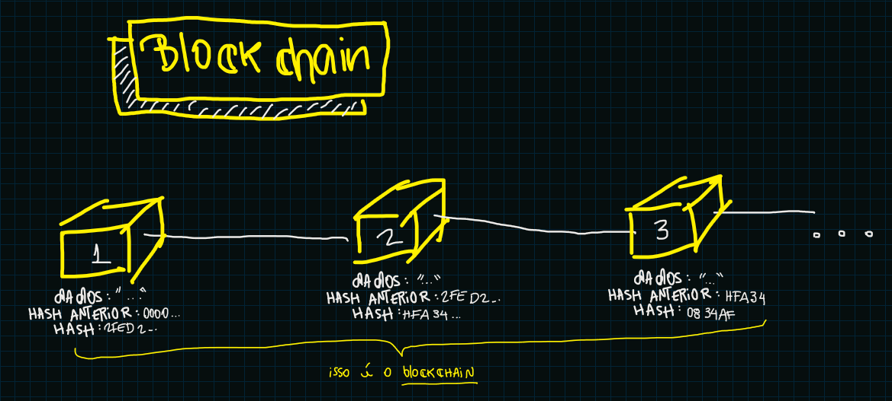
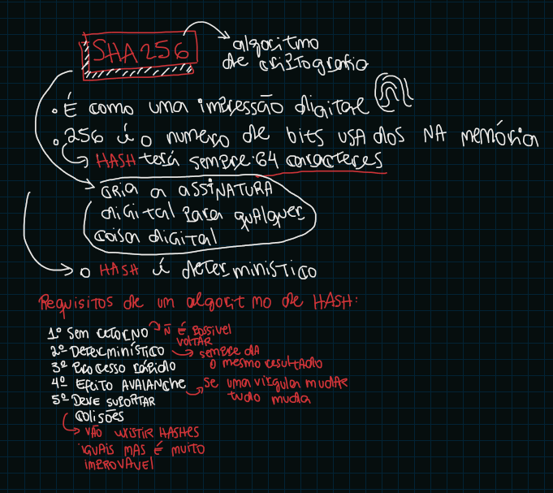
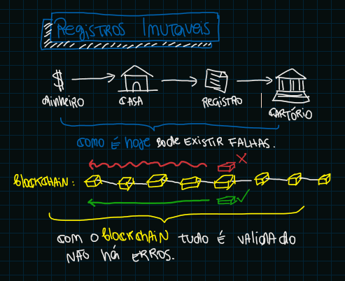
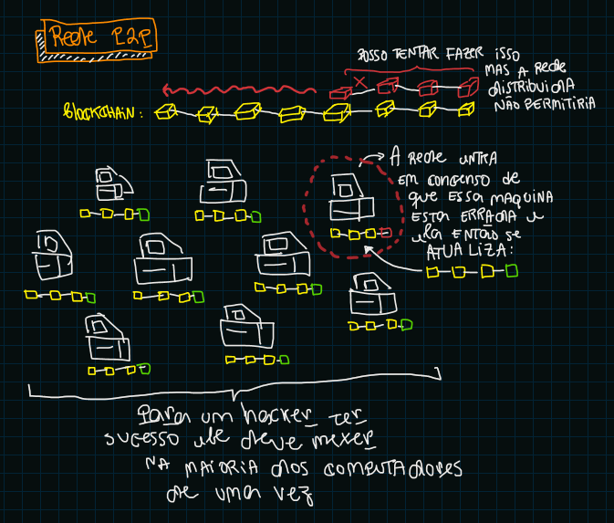
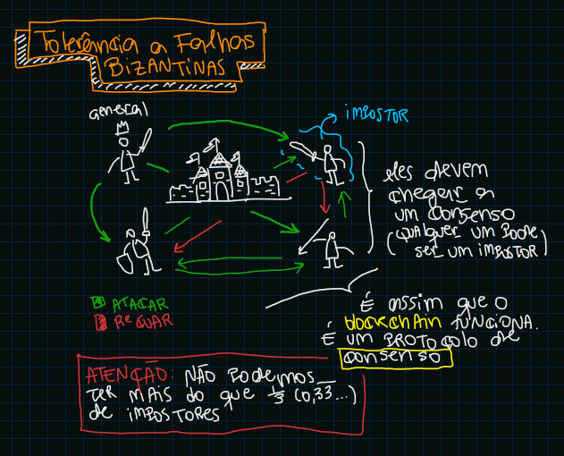
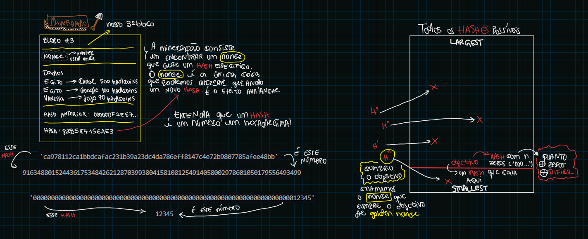
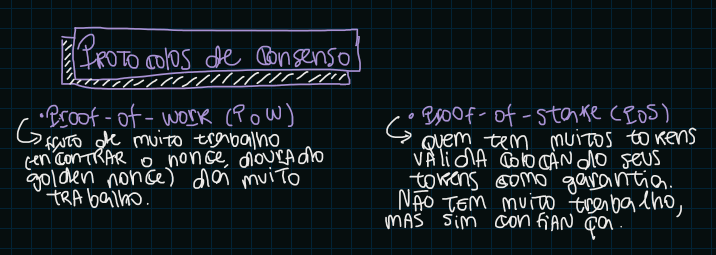

# Blockchain
## O que é o Blockchain?
**Blockchain** é como se fosse uma cadeia de transações no tempo, onde o "lote" de transações posterior tem uma ligação de dependencia com o "lote" de transações anteriores. Ou seja as transações estão conectadas.

## Como ocorre essa conexão?
A conexão entre os "lotes" (blocos) de transações acontece por meio da criação de um *HASH* que respeita uma certa condição e é gerado a partir do bloco anterior (lote de transação anterior).

## Mas pra que serve esse HASH?
O *HASH* ajuda a ter registros **imutáveis**, quando chegamos em um *HASH* válido toda a rede o toma como verdade e segue para o próximo bloco, alterar um bloco seria alterar todos os blocos anteriores, o que seria muito dificil (≈ impossivel)

## Como a rede distribuida funciona?
A rede distribuida valida o *HASH* gerado após validado ele é compartilhado. Para tentar alterar um bloco é preciso alterar a maioria das maquinas 51% o (≈ impossivel). A rede segue um protocolo de consenso ou seja ela entre em acordo entre as diversas maquinas de que um *HASH* é o ganhador e então compartilha essa informação.

## Tolerância a Falhas Bizantinas
Explica como um protocolo de consenso funciona e a sua eficiencia.

## Mineração
A mineração consiste em encontrar o **NONCE** um número [0, ∞[ que gere um *HASH* "vencedor" aquele que resolve o desafio, não é um calulo é algo **aleatório** e por conta disso a dificuldade de mineração.

## Protocolos de consenso
Temos dois tipos de protocolo de consenso:
1. PoW (Proof of Work): Prova de trabalho, prova que houve de fato muita computação para se chegar no **golden nonce** o que resolve o *HASH*
2. PoS (Proof of Stake): Prova de Partição, integrantes com muitos tokens fazem a validação colocando em cheque a reputação da rede através das suas moedas.

Para entender de forma *ilustrativa* como o **blockchain** funciona clique [aqui](https://andersbrownworth.com/blockchain/hash)
